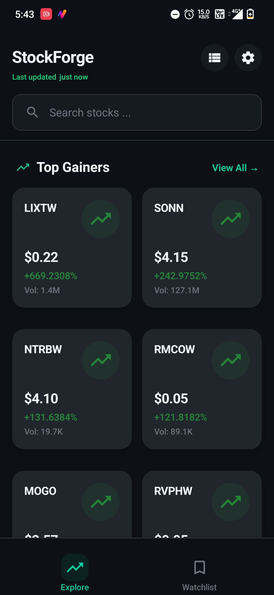
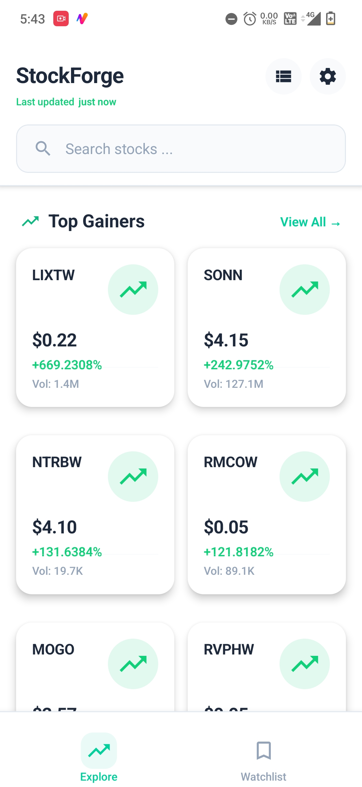
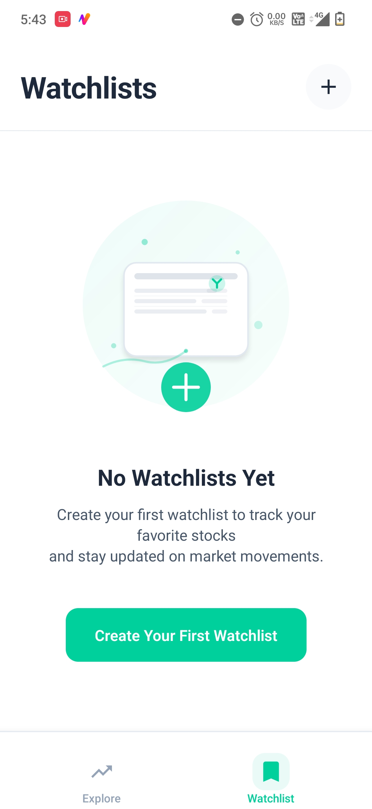
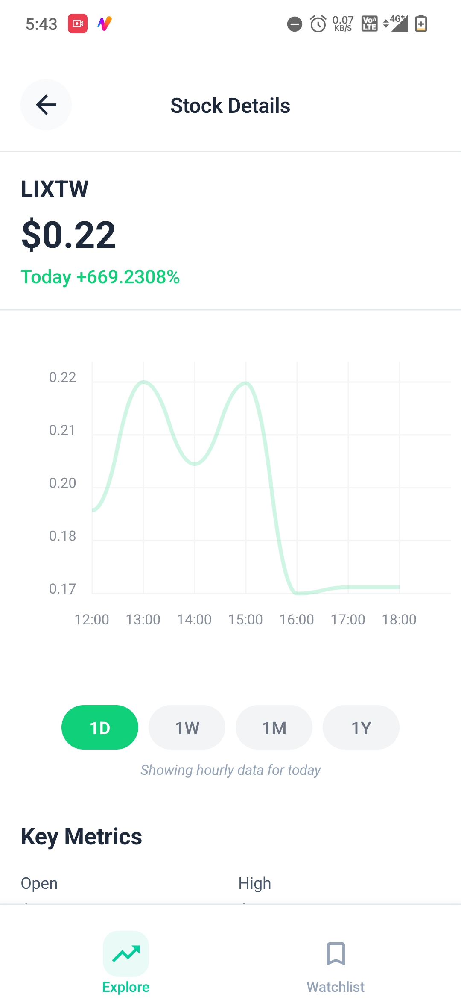
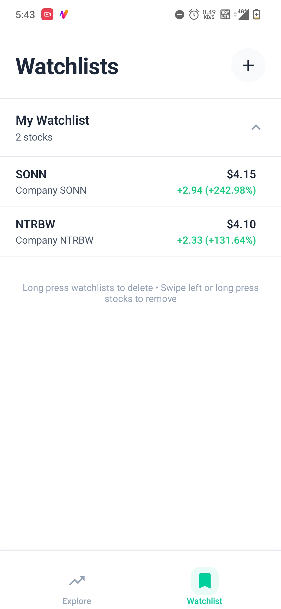

# StockForge - a stocks / etfs broking platform Mobile App

A feature-rich stock trading mobile application built with React Native. StockForge provides real-time market data, intelligent watchlist management, and a premium user experience designed for modern traders and investors.

## 📱 App Preview

### Screen Recording

<video width="300" controls>
  <source src="Record_2025-07-03-17-40-07.mp4" type="video/mp4">
  Your browser does not support the video tag.
</video>

### Screenshots

<div align="center">
  
  
  
  
  
</div>

## 🚀 Features

### Core Features

- 📈 **Real-time Market Data**: Live stock prices, gains/losses, and trading volumes
- 🔍 **Smart Explore Screen**: Browse top gainers, losers, and most actively traded stocks
- 📊 **Interactive Charts**: Detailed stock charts with multiple timeframes
- 📋 **Watchlist Management**: Create, edit, and manage multiple custom watchlists
- 🔍 **Advanced Search**: Find stocks quickly with intelligent search functionality
- 🌙 **Theme Support**: Beautiful light and dark themes with smooth transitions
- 📱 **Offline Support**: Smart caching and offline-first approach
- 🌐 **Network Detection**: Graceful handling of network connectivity issues

### User Experience

- ⚡ **Lightning Fast**: Optimized for performance with minimal app size
- 🎨 **Premium Design**: Clean, professional UI following modern design principles
- 📱 **Responsive**: Perfect experience across all device sizes
- 🔄 **Smart Caching**: Efficient data management with Redux state persistence
- 🎯 **Intuitive Navigation**: Seamless navigation between screens

## 🛠 Tech Stack

### Frontend

- **React Native 0.80.1** - Cross-platform mobile development
- **TypeScript** - Type safety and enhanced developer experience
- **React Navigation 7.x** - Navigation and routing
- **Redux Toolkit** - Predictable state management
- **React Native Vector Icons** - Beautiful icons throughout the app

### APIs & Services

- **Alpha Vantage API** - Real-time stock market data
- **Axios** - HTTP client for API communications
- **AsyncStorage** - Local data persistence
- **NetInfo** - Network connectivity detection

### Development Tools

- **Metro Bundler** - Optimized JavaScript bundling
- **ESLint & Prettier** - Code quality and formatting
- **Jest** - Unit testing framework
- **ProGuard** - Android code obfuscation and optimization

## 🧩 Component Architecture

### Screen Components

Each screen follows a consistent pattern with separate files for logic, styles, and presentation:

- **ExploreScreen**: Main dashboard with market overview
- **WatchlistScreen**: Manage and view custom watchlists
- **StockDetailScreen**: Detailed stock information with charts
- **ViewAllScreen**: Extended lists of stocks by category
- **NoInternetScreen**: Elegant offline experience

### Reusable Components

- **StockCard**: Displays stock information in card format
- **StockListItem**: List view representation of stock data
- **StockGridItem**: Grid view for compact stock display
- **WatchlistItem**: Individual watchlist management
- **ThemeSelector**: Theme switching interface
- **LastUpdatedBanner**: Shows data freshness information

### Modal Components

- **WatchlistCreateModal**: Create new watchlists
- **WatchlistPickerModal**: Select watchlists for stocks

## 🔧 State Management

StockForge uses Redux Toolkit for efficient state management:

### Store Slices

- **stockSlice**: Manages market data, loading states, and caching
- **watchlistSlice**: Handles watchlist CRUD operations
- **chartSlice**: Manages chart data and timeframe selection

### Key Features

- **Smart Caching**: Reduces API calls with intelligent cache management
- **Optimistic Updates**: Instant UI updates for better UX
- **Error Handling**: Graceful error states and retry mechanisms
- **Persistence**: Important data survives app restarts

## 🌐 API Integration

### Alpha Vantage Integration

The app integrates with Alpha Vantage API for comprehensive market data:

```typescript
// Real-time stock data
- Top Gainers/Losers
- Most Actively Traded
- Intraday prices
- Historical data
- Company information
```

### API Optimization

- **Request Batching**: Minimize API calls
- **Smart Caching**: Cache responses
- **Rate Limiting**: Respect API limits with queue management

## 📦 Build Optimizations

StockForge is optimized for minimal app size and maximum performance:

### Bundle Optimizations

- **Tree Shaking**: Remove unused code
- **Code Splitting**: Load features on demand
- **Minification**: Compress JavaScript and assets
- **ProGuard**: Android code obfuscation and optimization

### Performance Optimizations

- **Resource Optimization**: Compress images and assets
- **Console Stripping**: Remove debug logs in production
- **Bundle Analysis**: Monitor and optimize bundle size

### Current App Size

- **Debug Build**: ~22-27MB
- **Release Build**: ~15-20MB
- **Split APKs**: ~8-12MB each (arm64-v8a, armeabi-v7a)

## 🚀 Getting Started

### Prerequisites

- Node.js (v18 or higher)
- React Native CLI
- Android Studio (for Android development)
- Xcode (for iOS development)

### Installation

1. **Clone the repository**

   ```bash
   git clone https://github.com/mokshupadhyay/stockForge.git
   cd stockForge
   ```

2. **Install dependencies**

   ```bash
   npm install
   ```

3. **Install iOS dependencies** (iOS only)

   ```bash
   cd ios && pod install && cd ..
   ```

4. **Set up API key**
   - Get your free API key from [Alpha Vantage](https://www.alphavantage.co/support/#api-key)
   - Update `src/constants/api.ts` with your API key

### Running the App

```bash
# Start Metro bundler
npm start

# Run on Android
npm run android

# Run on iOS
npm run ios

# Run release build
npm run android:release
npm run ios:release
```

## 🏗 Building for Production

### Android Release Build

```bash
# Clean build
npm run clean:android

# Build release APK
npm run android:build

# Build release Bundle (for Play Store)
npm run android:build-bundle
```

### iOS Release Build

```bash
# Clean build
npm run clean:ios

# Build release
npm run ios:release
```

## 🧪 Testing

```bash
# Run unit tests
npm test

# Run tests with coverage
npm run test:coverage

# Run linting
npm run lint

# Format code
npm run format
```
